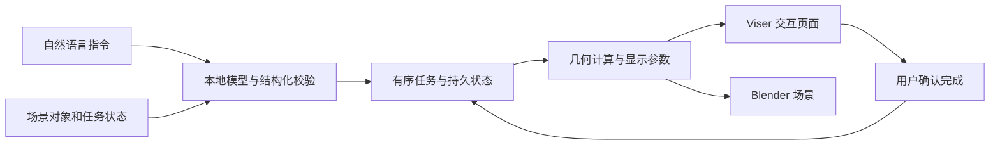

# HoloCue

**面向实体操作任务的全息焦深提示与交互仿真系统。**

HoloCue 将自然语言指令转化为有序操作步骤，并在三维场景中显示目标、动作轨迹与检查位置。项目结合本地大语言模型、Viser 交互页面和 Blender 场景，用于研究空间提示如何辅助装配、检修、搬运与结构检查，以及调试能够暂停、接受临时任务并恢复原流程的 Agent 系统。

## 主要功能

- **自然语言任务规划**：结合场景对象与当前状态理解指令，生成包含操作对象、接收对象、动作参数和顺序的结构化计划。
- **三维操作提示**：使用 Gaussian 提示表达目标、运动与深度需求，支持焦点、亮度、数量和宽度参数的解析响应。
- **持续任务状态**：保存步骤、实体位姿和执行进度，支持暂停、临时检查、恢复与明确完成确认。
- **交互观察**：在 Viser 中切换工作区域、目标特写和结构检查视角，每个浏览器连接拥有独立会话。
- **统一场景数据**：场景配置共同定义模型尺寸、坐标、接合位置、动作路径和观察面；Viser 与 Blender 可读取同一会话的对象、相机和提示数据。

当前显示响应采用解析 Gaussian 模型，用于任务与交互仿真。真实光学系统的标定和显示响应通过预留接口接入。

## 工作流程



模型负责解释任务语义，确定性模块负责几何计算和显示预算。动画到达终点后保持提示，用户确认完成后才推进任务并更新实体位姿。临时检查保留原步骤的身份、参数和进度。

## 场景

项目包含十二个仿真场景，覆盖旋转、插入、放置、多步骤操作和局部结构检查。

| 场景 | 任务示例 |
| --- | --- |
| 控制面板 `control_panel` | 旋转旋钮、检查端子背面 |
| 接插件 `connector` | 插头接合、定位键与端子检查 |
| 积木装配 `blocks` | 放置积木、观察底部结构 |
| 服务器机架 `server_rack` | 节点安装、后方接口检查 |
| 无人机工作台 `drone_bench` | 电池安装、防护件旋转、电机检查 |
| 货架拣选 `shelf_picking` | 物品搬运、筐体放置、标签检查 |
| 光学平台 `optical_bench` | 镜片安装、镜面旋转与检查 |
| 考古探方 `dig_site` | 对象指认、记录检查、标记放置 |
| 发动机舱 `engine_bay` | 卡箍操作、火花塞安装、连接器检查 |
| CNC 换刀 `cnc_toolchange` | 模式旋转、刀具安装、拉钉检查 |
| 充气训练站 `dive_fillstation` | 气瓶标识检查、接头接合、阀杆旋转 |
| 输液训练区 `infusion_ward` | 泵盒安装、袋体标识检查、旋塞操作 |

详细任务和几何定义见 [场景说明](docs/SCENE_REVIEW.md)。

## 使用

### 环境准备

需要 Python 3.11 或更新版本，以及提供 OpenAI 兼容接口的本地模型服务；默认模型配置为 Qwen3.5-4B。原生场景构建和渲染需要 Blender，场景 `.blend` 文件通过 Git LFS 管理。

在项目根目录准备应用环境：

```bash
git lfs pull
export TMPDIR="$PWD/.work/tmp"
export TMP="$TMPDIR" TEMP="$TMPDIR"
export XDG_CACHE_HOME="$PWD/.work/cache"
export PIP_CACHE_DIR="$PWD/.work/cache/pip"
export PYTHONPYCACHEPREFIX="$PWD/.work/pycache"
mkdir -p "$TMPDIR" "$XDG_CACHE_HOME" "$PIP_CACHE_DIR"
python3 -m venv .venv-simulation
source .venv-simulation/bin/activate
python -m pip install -e '.[dev,simulation]'
```

Viser 固定为 1.1.1，使用项目提供的绘制、相机协议和 HDR 透明度补丁。新环境按 [Viser 补丁说明](scripts/patches/viser_1_1_1/README.md) 和 [HDR 修复说明](scripts/patches/viser_1_1_1/HDR_OPACITY.md) 准备客户端。

### 启动交互页面

先启动本地模型服务，再在项目根目录配置模型端点并启动 API：

```bash
export HOLOCUE_MODEL_URL=http://127.0.0.1:8000/v1
export HOLOCUE_MODEL_NAME=Qwen/Qwen3.5-4B
bash scripts/run_simulation.sh api
```

在另一个终端的项目根目录启动页面：

```bash
bash scripts/run_simulation.sh viewer
```

浏览器访问 `http://127.0.0.1:8780`，选择场景并输入任务。API 默认地址为 `http://127.0.0.1:8750`；远程使用时可通过 SSH 转发端口。认证及其他环境变量见 [.env.example](.env.example)。

### 构建场景

`scenes/<id>/scene.json` 定义场景对象与任务，`meshes/` 保存实际网格。需要重新生成资产时，设置已有 Blender 的路径后运行：

```bash
export BLENDER_BIN=/path/to/blender
bash scripts/scenes/build_all.sh
```

构建流程依次生成 GLB、Blender 数据和原生场景。资源守卫随启动与构建脚本执行，临时文件及运行输出保存在项目内部。

## 项目结构

| 目录 | 内容 |
| --- | --- |
| `src/holocue/` | 任务规划、状态管理、几何计算、API 与 Viser 页面 |
| `scenes/` | 场景配置、网格和 Blender 场景 |
| `configs/`、`prompts/`、`schemas/` | 显示配置、模型提示词与数据协议 |
| `scripts/` | 启动、资产构建、桥接、资源守卫与检查工具 |
| `tests/` | 正式回归测试与固定几何输入 |
| `docs/` | 架构、接口、场景和研究资料 |
| `assets/` | 共用资产与来源、许可说明 |

源码修改使用 `python scripts/format_code.py` 格式化，并通过 `python scripts/format_code.py --check` 检查。前端及 Shell 格式化依赖通过 `npm ci --prefix tools/formatting --cache .work/cache/npm-formatting` 安装。

## 文档与许可

- [系统架构](docs/SIMULATION_ARCHITECTURE.md)
- [API 接口](docs/API.md)
- [场景与建模约定](docs/SCENE_REVIEW.md)
- [验证方法](docs/VALIDATION.md)

代码采用 [MIT License](LICENSE)。原创几何资产及第三方资产的授权范围见 [资产许可](assets/ASSET_LICENSE.md) 与 [资源来源](assets/downloads/SOURCES.md)；第三方依赖和模型权重遵循各自许可。
