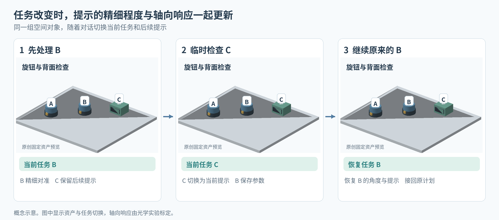
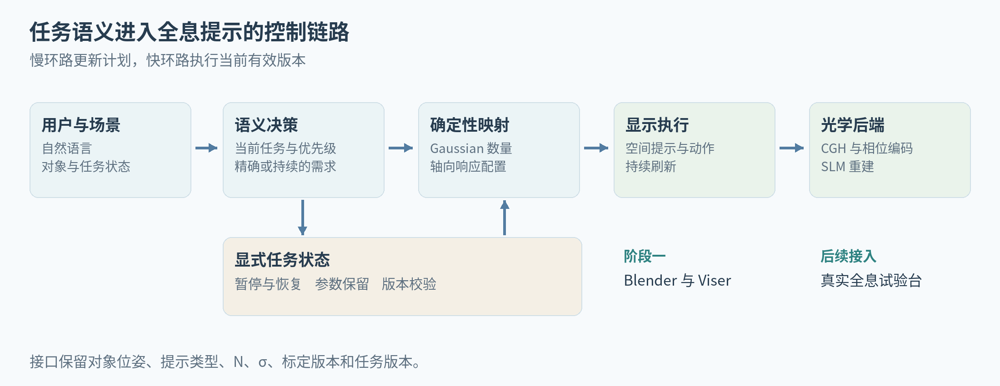

# HoloCue 任务驱动的全息焦深提示

论文思路与第一阶段系统总览  ·  2026 年 9 月 15 日

> 让任务决定提示如何被看见。当前操作需要精确对准，后续步骤需要保留上下文。我们将这些差异转成可控制、可测量的全息提示属性。

本文研究交互式全息显示中的提示组织。当多个提示位于不同深度时，它们承担的任务角色不同。系统根据当前操作、后续步骤和临时打断，联合安排提示的表示精度与轴向可辨认范围，让显示内容跟随任务进程变化。

## 读完后应该记住什么

全息显示提供了一种可以沿深度变化的信息表达方式。HoloCue 将这一能力接入任务交互，使提示在何处出现、需要多精细、随调焦怎样变化，都有明确的任务依据。大模型处理开放语言与重规划，显式状态保持任务连续性，光学侧实现可复现的显示。

本稿给出研究主张、方法设计和实验计划。已经完成的代码基础与尚待现场执行的环节在交付记录中分别列出，文中的示意图用于解释设计。

# 01  从任务需求定义两个控制量

一条提示可以同时携带操作内容与显示需求。转动角度需要被准确辨认，下一步提示需要在任务切换时仍可找到。Gaussian 数量 N 用来约束表示开销，Gaussian 宽度 σ 通过已标定的传播和成像链路控制轴向响应。

| 任务信息 | 确定性映射 | 显示目标 |
|---|---|---|
| priority | 在总预算内分配 N | 优先保障当前有效信息的几何细节 |
| depth_requirement | 选择标定后的 σ 配置 | 提供精确定位或持续保留所需的轴向响应 |
| task_role 与目标对象 | 确定显示顺序、内容和空间锚点 | 让当前任务、后续步骤和背景保持一致 |

N 和 σ 是两个可控参数，其效果通过联合标定确定。第一阶段采用总预算 6000 的比例分配基线，以及相对 σ 配置 1、2.5、4，用于跑通参数接口。光学版本用真实测量替换配置，并保留来源和版本。

深度需求单独保留很重要。精确对准目标通常需要较窄的响应，跨深度提醒则可能需要较宽的可见范围。任务优先级与焦深需求分别进入映射，使系统能表达这两类情况。

# 02  系统怎样完成一次交互

输入包括自然语言、已知对象清单和当前任务状态。Agent 输出目标对象、动作、角色、优先级与深度需求。场景校验确认对象和动作有效，状态事务保存任务队列，映射模块生成具体 N 和 σ。显示端持续执行当前有效版本。

## 一次典型的打断与恢复

用户先要求把 B 逆时针转 30 度，再查看 C 的背面。系统显示 B 的环形箭头和角度，同时保留 C 的下一步提示。用户中途改成先检查 C，旧动作立即停止，B 的角度、任务标识和后续队列一起保存。C 检查完成后，系统恢复原来的 B 步骤。

大模型负责理解临时要求和约束组合。任务状态由程序显式维护，因此暂停、恢复和旧响应失效都有可验证的行为。慢环路更新计划，快环路执行动作与显示；二者共用有版本的显示包。

## 第一版场景条件

场景几何来自预先建立的对象清单，模型可读对象名称、能力和状态。物体坐标由场景直接提供。这样的设置把第一阶段的观察重点放在任务理解、交互连续性和显示参数联动，后续可在相同接口接入图像与实际定位。

代码按一个规划 Agent、两个处理节点和一份 SQLite 权威状态实现。新增场景主要增加资产、对象能力和锚点，核心状态逻辑可以复用。

# 03  与相关工作的关系怎样讲

相关工作应先围绕全息显示的能力发展展开，再引入任务交互。计算全息已有高效波场表示，焦深研究已经关注瞳孔条件和成像响应，语言交互也已进入全息系统。本文进一步把这些能力组织为任务条件化的提示控制问题。[R01–R06]

| 研究路线 | 已有成果 | 本文进一步研究的内容 |
|---|---|---|
| GWS 与 RPWS [R01][R02] | 紧凑基元到波场的生成，并分析离焦、混合与瞳孔条件。 | 在同一显示链路内，根据任务需求选择提示的轴向响应和表示预算。 |
| Pupil-Adaptive Holography [R03] | 根据瞳孔状态调整三维重建与焦深。 | 以任务角色和显示目的作为控制条件，研究不同提示的可辨认范围。 |
| Semantic Depth of Field [R04] | 用语义相关性决定清晰和模糊的图像表达。 | 将语义组织延伸到全息成像的真实轴向响应，并测量任务效用。 |
| 交互全息数字人 [R05] | 将语言交互、数字人动作和全息重建接成系统。 | 面向稀疏空间操作提示，结合参数化动作、任务恢复和焦深编码。 |
| Guided Reality [R06] | 生成步骤、高亮、动作示范等空间指导。 | 研究这类指导在全息光学中的呈现属性与物理控制。 |

## GaussLite 应该放在哪里

GaussLite 研究机器人建图中的任务相关采样、尺度和优化投入。它适合在表示预算的背景中选择性引用；本文解决全息提示的轴向呈现和交互控制，主要实验对照应围绕相同光学系统里的提示策略展开。[R07]

这条相关工作组织方式让贡献落到具体研究对象上。比较重点是任务条件、光学控制量和证据，而非参数名称是否相同。

# 04  三组证据支撑一条主线

| 问题 | 最小实验 | 支持的结论 |
|---|---|---|
| 轴向响应是否可控 | 固定内容与位置，交叉改变 N 和 σ，测焦内质量、实际调焦扫描和生成时间。 | 建立参数与真实显示响应的关系。 |
| 控制是否有任务价值 | 相同总预算下比较固定配置、只调 N、只调 σ、联合控制；加入亮度或图像模糊对照。 | 分清表示投入和光学焦深编码带来的收益。 |
| 动态交互是否连续 | 改变任务顺序、临时增加检查、恢复未完成任务，记录原参数、错误和反应时间。 | 证明语义变化能够可靠地更新显示。 |

第一组实验由合作者负责。焦点扫描需记录光路、相机镜头或眼模型、孔径、亮度归一化和 Gaussian 定义。测得曲线进入统一标定文件，供 Agent 侧使用。

第二组实验选择两个有深度差异的目标和少量提示即可。任务指标可以是目标选择、角度识别、插接关系判断和中断后的恢复时间。先用能区分关键解释的实验确定方向，再扩展用户研究。

## 多个场景各自承担什么

| 场景 | 交互能力 | 重点证据 |
|---|---|---|
| 旋钮与模块 | 角度参数、临时检查、恢复旧任务 | 任务状态与精确提示的连续性 |
| 插头与插座 | 空间锚点、运动演示、暂停继续 | 三维方向与深度关系 |
| 积木搭建 | 顺序计划、对象指代、步骤切换 | 相同接口对不同内容的复用 |

多场景用于展示控制方式的复用，受控实验用于解释收益。页面刷新、模型响应和实际 CGH 更新分别计时。示意响应面板、真实波场仿真、光学测量和用户结果分别保存。

# 05  面向光学论文的写作骨架

## 建议题目

HoloCue: Task-Conditioned Axial Response Control for Interactive Holographic Guidance

中文可以使用“面向交互式全息引导的任务条件化轴向响应控制”。项目简称服务于代码协作，论文题目突出研究对象与控制能力。

## 引言推进方式

第一段从具体显示问题进入。多步骤交互包含正在操作的对象和需要保留的后续信息，不同提示对精细程度和可见范围的需求随任务改变。全息重建提供真实深度表达，为这种差异化组织提供了可控制的光学维度。

第二段介绍已有基础。高效 Gaussian 波场生成、瞳孔相关焦深控制和语义交互分别提供计算、光学与任务输入。本文关注它们之间的具体连接，即如何将任务角色转为可执行的轴向响应，并在有限表示预算下保持交互连续。

第三段提出 HoloCue。语言模型解析任务与临时变化，确定性映射选取 Gaussian 数量和经标定的宽度配置，版本化状态把语义计划连接到持续显示。实验围绕参数可控性、光学呈现和任务效用形成相互衔接的证据。

## 贡献可以这样陈述

本文提出任务条件化的全息轴向响应控制，将精确操作与上下文保留转成可测量的显示需求。本文构建受预算约束的 Gaussian 提示表示，通过角色、重要性和深度需求生成可复现的显示配置。本文建立支持临时打断与恢复的交互系统，并设计跨光学测量与任务行为的验证协议。

正式投稿时，最后一句按真实完成的实验与发现改写。已测结果写入摘要和结果段，尚未完成的目标保留在研究计划中。

## 摘要讨论稿

交互式全息引导需要同时呈现当前操作与后续信息，而这些提示对精细程度和轴向可见范围的需求随任务变化。本文提出 HoloCue，将任务语义映射为受预算约束的 Gaussian 提示和经标定的轴向响应。语言模型解析用户指令与临时任务变化，确定性映射生成表示数量和宽度配置，显式状态支持提示切换、参数保留与任务恢复。系统围绕光学响应、显示效率和任务执行建立统一验证链路，为任务相关的全息信息组织提供一种可实现的框架。

# 06  合作分工与阅读入口

| 负责人 | 本阶段交付 | 后续连接点 |
|---|---|---|
| Agent 与仿真侧 | 本地模型、语义协议、状态管理、Blender 与 Viser、任务测试。 | 输出有版本的显示包，读取合作方标定。 |
| 全息光学侧 | Gaussian 与 σ 定义、N–σ 标定、真实 CGH、相位编码、SLM 和光学测量。 | 提供标定文件、可运行后端和测量数据。 |
| 共同部分 | 选择少量关键任务，确定光学变化与行为指标的对应关系。 | 完成物理控制到任务价值的证据链。 |

第一阶段的完成标志是本地模型真实运行、三场景联动、打断恢复正确以及参数包可导出。完整论文以光学侧测量和任务验证为依据。各部分按同一套对象、单位、任务版本和标定版本交接。

## 关键参考资料

[R01] [Gaussian Wave Splatting](https://bchao1.github.io/gaussian-wave-splatting/)。SIGGRAPH / ACM TOG，2025。全息表示和波场生成的主要基础。

[R02] [Random-phase Wave Splatting](https://arxiv.org/html/2508.17480v2)。arXiv 2508.17480，已读 v2。用随机相位和相应混合方法改善离焦、视差及眼盒表现。

[R03] [Pupil-Adaptive 3D Holography Beyond Coherent Depth-of-Field](https://arxiv.org/abs/2409.00028)。arXiv 2409.00028，2024。瞳孔状态与焦深控制的光学近邻，研究目标为视觉重建。

[R04] [Semantic Depth of Field](https://eagereyes.org/publications/Kosara-InfoVis-2001)。IEEE InfoVis，2001；DOI 10.1109/INFVIS.2001.963286。语义相关性控制图像模糊，适合交代清晰度编码的交互背景。

[R05] [Tri-Attention Complex-Valued CNN for Multimodal Holographic Digital Human Interaction](https://opticapublishing.figshare.com/collections/Tri-Attention_Complex-Valued_CNN_for_Multimodal_Holographic_Digital_Human_Interaction/8348008)。Optics Express，2026。多 Agent 与真实全息数字人交互的直接先例。

[R06] [Guided Reality](https://arxiv.org/html/2508.03547v1)。UIST，2025；DOI 10.1145/3746059.3747784。大模型生成多种空间指导形式的直接系统参考。

[R07] [GaussLite: Online Task-Conditioned 3D Gaussian Splatting for Real-Time Robotic Mapping](https://arxiv.org/html/2606.30809v1)。arXiv 2606.30809，2026。机器人建图的任务相关预算、密度与尺度控制，可选跨领域背景。

完整资源表见 08_相关工作与资源索引.md。阶段一执行计划、场景协议、接口和服务器约束分别见 04 至 07 号文档。
