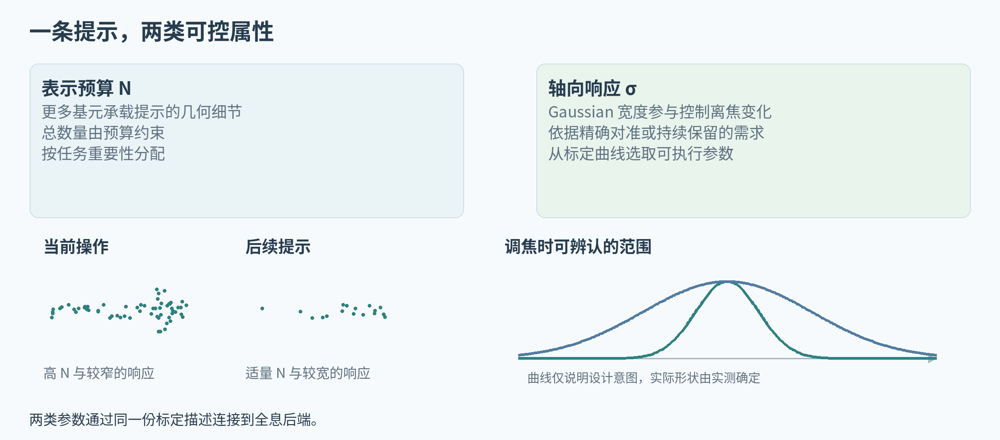

# 给合作者 全息光学调研与交接

HoloCue 光学侧工作说明  ·  2026 年 9 月 15 日

> 光学侧的核心交付是一个经标定的提示控制接口。输入提示内容、对象位姿、数量预算和轴向需求，输出可加载的全息图以及可追溯的重建证据。

本文的光学切入点是让不同任务提示具有不同的轴向可辨认范围。当前操作可以强调特定目标深度的精确呈现，后续提示可以保留更宽范围的上下文。N 约束表示投入，σ 通过具体波场模型影响轴向响应。

Agent 侧会交付 task_role、priority、depth_requirement、目标对象和动作。实体位姿由场景或实际定位给出。光学侧负责把这些信息转换成实际可用的参数范围，并完成波场、相位编码和实验台执行。

后续全息实现由合作方独立推进。共同接口保持单位、坐标、任务版本和标定版本一致即可，Agent 侧无需介入 SLM 细节。

# 01  优先看的光学工作

| 资料 | 值得读取的部分 | 对本文的直接用途 |
|---|---|---|
| GWS [R01] | 二维 Gaussian 到解析波场，几何混合和快速实现。 | 确定基元的数学定义、坐标与实际 σ 参数。 |
| RPWS [R02] | 相位分布、离焦变化、随机相位混合和瞳孔表现。 | 检查宽响应来自何种物理机制，选择与现有光路兼容的实现。 |
| Pupil-Adaptive Holography [R03] | 瞳孔条件与焦深控制。 | 将任务需求与眼盒、孔径等成像条件分开标定。 |
| 交互全息数字人 [R05] | 交互链路、CGH 和真实光学演示。 | 作为实时语义交互到全息执行的系统参照。 |

## 本文可以承接的研究问题

已有工作为高效波场重建与焦深控制提供了基础。本文研究多条任务提示怎样共享这些能力，以及控制后的轴向可见性怎样帮助用户区分当前操作与后续信息。相关工作以光学目标和实验条件组织，机器人建图预算作为可选背景即可。

## 需尽早固定的定义

请明确 σ 位于物体平面、SLM 平面还是 Gaussian 的局部坐标；它描述幅值还是强度的标准差，采用二维各向同性还是完整协方差；缩放 σ 时幅值和总能量如何归一化；多基元怎样合成、遮挡和编码。

这些定义决定轴向和横向效果的解释。理想波束关系可以辅助理解，最终参数选择应由现有 CGH 与真实光路的数据支持。尤其需要检查改变 σ 后焦内细节、亮度和视点依赖是否一起改变。

# 02  最小标定与光学实验

| 步骤 | 输入与控制 | 保存内容 |
|---|---|---|
| 单提示标定 | 同一箭头或字母，固定物理尺寸、目标深度和归一化方式；交叉改变 N、σ。 | 焦内图、实际调焦序列、横向质量、峰值与总能量、分阶段时间。 |
| 多提示组合 | 两个或三个深度，各自选择窄或宽响应；总 N 相同。 | 串扰、遮挡、不同瞳孔或相机孔径条件下的稳定性。 |
| 任务对照 | 固定配置、只调 N、只调 σ、联合控制；增加亮度或图像模糊编码。 | 目标或角度识别、空间关系判断、中断恢复表现及原始试次。 |

先选覆盖现有系统有效范围的三档 N 和三档 σ，得到九种组合。档位由设备和既有实验确定，文档不代设物理数值。确认变化足够明显后再扩大采样，避免在无效范围密集扫描。

调焦测量应包含镜头或眼模型下的成像变化。自由空间某传播截面的强度变化，可作为波场诊断；相机实际调焦的序列用于回答提示怎样随观察焦点变化。两类数据分开命名。

轴向指标可以使用达到约定可辨认阈值的深度区间，以及相应区间内的对比度或识别结果。峰形复杂时直接报告曲线与可辨认区间。对 Gaussian 数量记录合成、编码、传输和实际更新的分段开销。

## 对应论文的证据

标定说明控制量如何作用于真实显示，多提示实验证明控制可以组合，任务对照说明这种变化有什么用途。光学安全与人眼观察由合作方按现有实验室流程组织，进入用户实验前明确激光与显示条件。

# 03  请交付哪些文件

| 文件或模块 | 必要内容 |
|---|---|
| 光学定义说明 | σ 定义、基元类型、幅值与相位、波长、SLM 参数、光路和观察条件。 |
| calibration.json | 配置版本、合法范围、单位、参考面、坐标变换、各显示需求的映射。 |
| 标定原始数据 | N–σ–质量–时间表，焦点扫描序列及采集元数据，避免只交最终选定档位。 |
| Gaussian 数据接口 | 局部位置、局部基或朝向、尺度、幅值、相位和合成规则，格式带版本。 |
| CGH 执行入口 | 给定输入生成相位图的可复现命令或 Python 接口，依赖与设备要求。 |
| 显示执行确认 | 接受的任务版本、已加载帧、取消结果、真实更新时间和错误信息。 |

代码包包含 configs/optical_calibration.template.json。空字段表示等待合作方填写，当前相对 σ 保存在另一个 preview 配置中。物理参数由合作方填写，不将相对档位直接换单位。

## 坐标和版本约定

Agent 输出世界坐标为米制右手系、Z 向上，姿态为 wxyz 四元数。世界到光学坐标的变换由实际安装标定。每条显示请求包含 session_id、revision、epoch 和 calibration_id，过时的请求应丢弃。

光学适配器预留 capabilities、submit、cancel。建议 submit 返回接受版本、加载帧标识、时间戳和错误；cancel 指定会话与 epoch，避免旧任务在网络迟到后重新出现。

# 04  合作边界与下一次交接

第一阶段请优先回答 σ 的确切定义、实际支持的 N 和 σ 范围、对亮度和焦内细节的影响，以及现有 CGH 的时间分解。Agent 侧据此加载标定文件，保留相同语义协议。

下一次联调可以只接一个箭头和两个深度。先确认坐标、大小、轴向响应、相位图加载和取消版本，再扩展到模块旋转或插接动画。由此可以快速定位问题属于任务、表示、传播还是设备执行。

## 共同验收的单页结果

同一个对象的焦内图和焦点扫描曲线；一张 N–σ–质量–时间表；固定总预算下两种提示策略的重建比较；一次任务切换的加载时间线；一份可重现的输入与标定快照。所有图注明真实测量、仿真或示意来源。

## 参考资料

[R01] [Gaussian Wave Splatting](https://bchao1.github.io/gaussian-wave-splatting/)。SIGGRAPH / ACM TOG，2025。全息表示和波场生成的主要基础。

[R02] [Random-phase Wave Splatting](https://arxiv.org/html/2508.17480v2)。arXiv 2508.17480，已读 v2。用随机相位和相应混合方法改善离焦、视差及眼盒表现。

[R03] [Pupil-Adaptive 3D Holography Beyond Coherent Depth-of-Field](https://arxiv.org/abs/2409.00028)。arXiv 2409.00028，2024。瞳孔状态与焦深控制的光学近邻，研究目标为视觉重建。

[R05] [Tri-Attention Complex-Valued CNN for Multimodal Holographic Digital Human Interaction](https://opticapublishing.figshare.com/collections/Tri-Attention_Complex-Valued_CNN_for_Multimodal_Holographic_Digital_Human_Interaction/8348008)。Optics Express，2026。多 Agent 与真实全息数字人交互的直接先例。

[R17] [hsplat](https://github.com/computational-imaging/hsplat)。计算成像作者代码；访问 2026-09-15。后续 Gaussian 全息生成的候选代码接口。

文献版本与核验程度见 08_相关工作与资源索引.md。光学侧的实验细节可放补充材料，正文围绕任务需求、轴向控制和实际收益推进。
