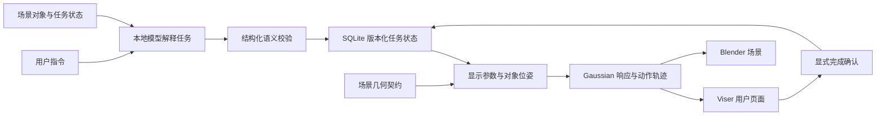

# HoloCue 仿真系统

## 场景与执行

每个场景使用 `scenes/<scene_id>/scene.json` 保存对象、尺寸、位姿、动作能力、接合坐标系、检查面和观察范围。场景模型采用标准 glTF 坐标，运行时统一使用米制、Z 轴向上的世界坐标。

模型只提交语义字段。确定性模块执行预算分配、位姿计算与响应参数转换。`task_contract.ordered_steps` 是验收规范，模型请求中使用场景对象说明与用户输入，验收规范保留在评价端。

源对象的接合坐标系表示能够与目标接触的部位。插入或放置的终点由目标位姿、目标接合坐标系和源接合坐标系的逆变换共同计算。提起、移出、接近与装入路径使用场景声明的方向和间隙。旋转使用对象自身声明的转轴与支点。

动画到达终点后保持显示。用户确认完成时，任务记录进入 completed，物体实体位姿随之更新。暂停与打断期间保留任务时间。恢复使用原 task_id，延续已保存的动作进度与参数。

## 任务状态

SQLite 保存任务队列、挂起计划、完成记录、revision 和 epoch。一次请求提升版本并使旧显示停止运动。迟到的模型结果通过版本检查失效。`snapshot` 在同一份状态上生成状态与显示包，网页只接收版本一致的数据。

同一对象能够依次执行多个动作。计划队列保留完整顺序，显示端选取该对象最早的未完成步骤。模型记录中保存原始请求、原始回复、模型名称、提示词摘要和延迟。

真实模型生成 operation、cues 和每步 instruction。非澄清决策的 assistant_message 在严格生成协议中为 null，表示没有额外的模型说明文本；应用不会补写或删除模型回复。clarify 保留模型针对实际缺失信息提出的问题。违反这个字段协议的回复会报错，原始请求和回复仍完整记录。已提交的历史内容保存实际结构化决策，历史版本的字符串仍可读取。

页面展示模型原始步骤 instruction 与真实任务状态、挂起计划和错误。按钮操作与服务恢复可以显示应用产生的事实状态文本。取消额外说明通道不保证每步 instruction 永远正确；真实模型验收仍须审核步骤文字、顺序、参数和状态。

场景指纹包含场景配置和实际资产摘要。几何变更后使用新会话，已有持久记录保持原有含义。运行时只有 live 模型入口。输入校验失败、模型异常和资源异常均产生明确错误。

## 用户页面

每个浏览器连接拥有独立的场景节点、相机、任务会话与显示时钟。切换场景后释放该连接的旧节点。网络请求在单独工作线程中执行，持续显示使用独立时钟。

工作区域视角显示场景布局与任务对象。目标特写根据实际网格和浏览器宽高比计算视点。结构检查根据对象声明的检查面调整相机，并单独呈现需要检查的真实部件。检查对象、任务阶段与观察方式同时显示在页面中。

选择目标特写或结构检查时，取景还包含所选对象当前显示提示的实际中心。提示边界使用同一解析配置在零离焦时的三倍标准差范围，仅用于确定名义取景包络。原视图已经容纳提示时保持不变；发生裁切时，按目标几何或声明的检查区域与提示包络的并集重新取景，保留原观察方向、向上方向和场景留白。该过程不改变实际提示数组、N、sigma 或响应模型，也不在每次焦距、亮度变化或动画更新时自动缩放。用户主动离焦产生的扩散仍按原解析模型显示。

对象可以通过 `anchors.label` 声明 Viser 对象标识的局部米制位置；未声明时使用实际网格上方的默认位置。标识随对象实体位姿移动，结构检查模式隐藏全部标识。该锚点只影响屏幕标识，不参与动作轨迹、检查面、Gaussian 提示或 Blender 模型内的文字纹理。发动机场景的 CONN 使用 `[-0.04,0,0.025]`，使标识与 TENSIONER 分开。锚点属于场景配置，变更会更新场景指纹，之后应创建新会话。

窗口宽度改变时重新计算观察范围。自动跟随功能按照当前动作选择观察方式；用户能够关闭跟随，自行检查场景。

## 显示响应

BLUE 的检查点 y=0.112 m，而背面标签与边沿最高到 y=0.115 m，配置 5 mm 检查提示间距，环平面 y=0.117 m。

检查动作 `inspect_back` 的高亮环使用检查面的 `inspect_point_local_m` 和 `inspect_normal_local`，沿法向增加 `inspect_cue_clearance_m`，不复用指认动作的通用 `cue_offset_local_m`。默认 2 mm 是场景提示与表面的显示间距，不是光学标定；NODE3 后连接器凸出到局部 y=0.245 m，检查点 y=0.232 m，因此该场声明 15 mm，使提示平面位于 y=0.247 m。物体原始网格、其他动作位置、N 和 sigma 分配保持原合同。缓存只保存基础环形采样，检查动作平移独立副本，不改变同对象的指认提示。

检查提示的几何验证使用实际 GLB 三角形，从声明的检查法向一侧采样环点并比较前后深度。它只覆盖实际采样点，不能证明整个表面或任意视角均无遮挡。实际界面响应验收使用声明法向一侧的结构检查视角，隔离所选对象并保存检查面、相机与画布范围；移动动作使用包含路径和接收对象的工作区域视角。

`configs/preview_response.json` 声明解析 Gaussian 包络模型。宽度映射、波长、显示放大倍率与光学厚度均有明确参数。Gaussian 数量改变实际使用的采样数量，sigma 改变包络协方差，焦点距离通过离焦距离影响包络与可见强度，亮度控制参与实际 alpha 合成。

Viser 使用 Gaussian splats，Blender 使用具有 Gaussian alpha 纹理的面向相机图元。两端接收同一份中心、半径、颜色与不透明度数据。相机位置、朝向、视场角、当前对象、焦点和任务时间均通过版本化帧交换。

Viser 保持 1.1.1，客户端使用 `scripts/patches/viser_1_1_1` 中的局部修复：保留正透明度的小点，避免上游单点尺寸近似剔除整个密集提示；四边形顶点包含零 Z 坐标，使 Three.js 的包围球计算接收三维坐标。该修复不改变传入的中心、协方差、颜色、透明度或解析参数。客户端在项目 `.work` 中依照原始依赖锁文件构建，部署时保存原静态文件和构建摘要；运行时提供的页面摘要与构建产物核对。真实画布响应与两端数据一致性分别验证。

两端的一致性检查针对输入数组、相机和任务时间。Viser 1.1.1 内部将 RGBA 打包为 8 位整数，协方差打包为半精度浮点；低于 1/255 的单点透明度会截断为零。Blender 使用浮点透明度，因此未聚焦的弱提示可能在 Viser 中不可见而在原生图像中仍有淡光晕。该精度差异不改变记录的解析输入，但不能把输入一致性表述为最终像素一致。手动改变观察视角会保留当前焦距；“聚焦选中对象”依据当前相机与目标重新计算焦距。

当前响应的证据范围是解析包络与交互显示。真实 SLM 的传播、孔径、相位编码、散斑和眼模型由光学适配器提供标定。论文中的仿真结果使用 `analytic_gaussian_preview` 标识。

## 模块职责

| 模块 | 职责 |
|---|---|
| models.py 与 config.py | 数据协议、场景加载、指纹与输入校验 |
| provider.py 与现有 graph.py | 真实模型请求、结构化输出与语义校验 |
| state.py 与 store.py | 任务转换、持久化、请求幂等和版本竞争 |
| spatial.py 与 projection.py | 源目标接合、任务轨迹、实体位姿和显示预算 |
| camera.py 与 assets.py | 坐标转换、实际网格边界、观察范围与资产加载 |
| response.py 与 bridge.py | Gaussian 响应、统一数据帧和原子文件交换 |
| viewer.py 与 viewer_scene.py | 用户界面、连接隔离、相机与持续显示 |
| modeling.py | 尺寸化部件、空腔、工作台、材质和标签 |

## 后续光学接口

保留现有 `HolographyAdapter` 的 capabilities、submit 与 cancel 接口。光学端读取任务标识、对象坐标、N、sigma、版本和标定信息。服务部署到内网时启用认证，并继续使用版本信息拒绝过期显示。仿真参数与物理标定参数分别保存。
